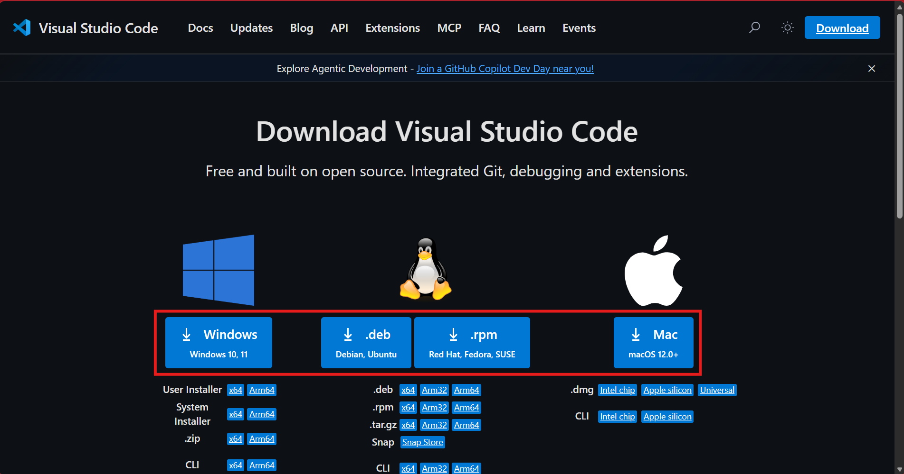
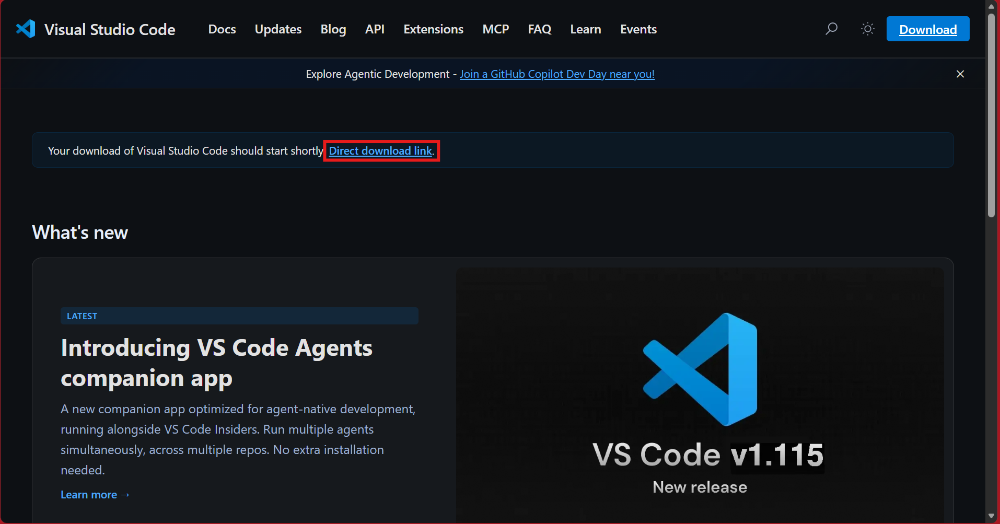
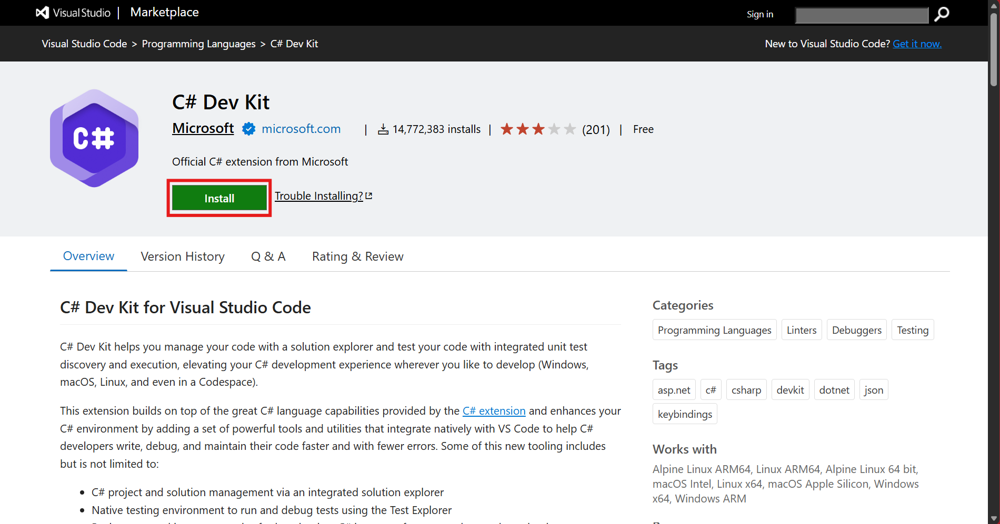
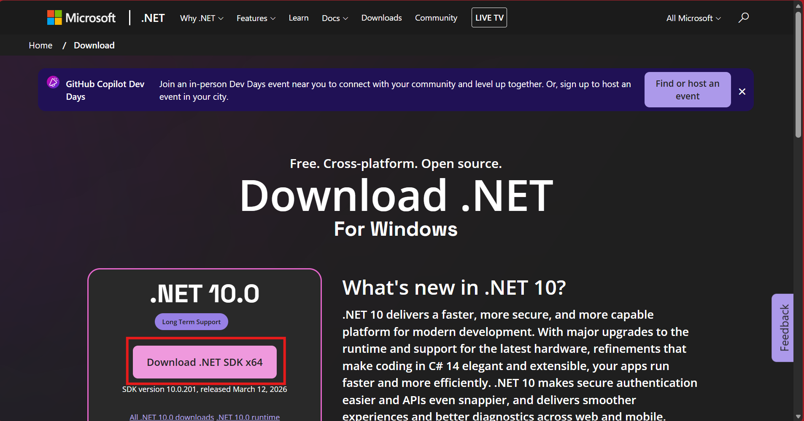

# C\# for Game Development Workshop Installation Guide

Please follow the installation guide and ensure that all applications have been installed before attending the workshop.

## Visual Studio Code

1. Go to [https://code.visualstudio.com/download](https://code.visualstudio.com/download).

2. Choose your operating system and click on the download button. You should be redirected to this page and the download should start automatically. If the file is not downloading, click on “Direct download link”.

3. Open the file that was installed on your computer, and follow the steps to install Visual Studio Code.

## C\# Dev Kit

1. Go to [https://marketplace.visualstudio.com/items?itemName=ms-dotnettools.csdevkit](https://marketplace.visualstudio.com/items?itemName=ms-dotnettools.csdevkit).  
2. Click “Install”, which will open Visual Studio Code and redirect you to the “Extension: C\# Dev Kit” page.

3. Click “Install” to install the C\# Dev Kit extension to Visual Studio Code.

## .NET SDK

1. Go to [https://dotnet.microsoft.com/en-us/download](https://dotnet.microsoft.com/en-us/download).

2. Click on the “Download .NET SDK” button to download the .NET SDK.

## Any issues?

If you are facing any technical issues, you may:

* Refer to this link: [https://code.visualstudio.com/docs/csharp/get-started](https://code.visualstudio.com/docs/csharp/get-started), or  
* Watch this YouTube video: [https://www.youtube.com/watch?v=ZVGutgqBMUM](https://www.youtube.com/watch?v=ZVGutgqBMUM).

If you are still facing any technical issues after watching the video, open a ticket on the BuildingBloCS Discord server.